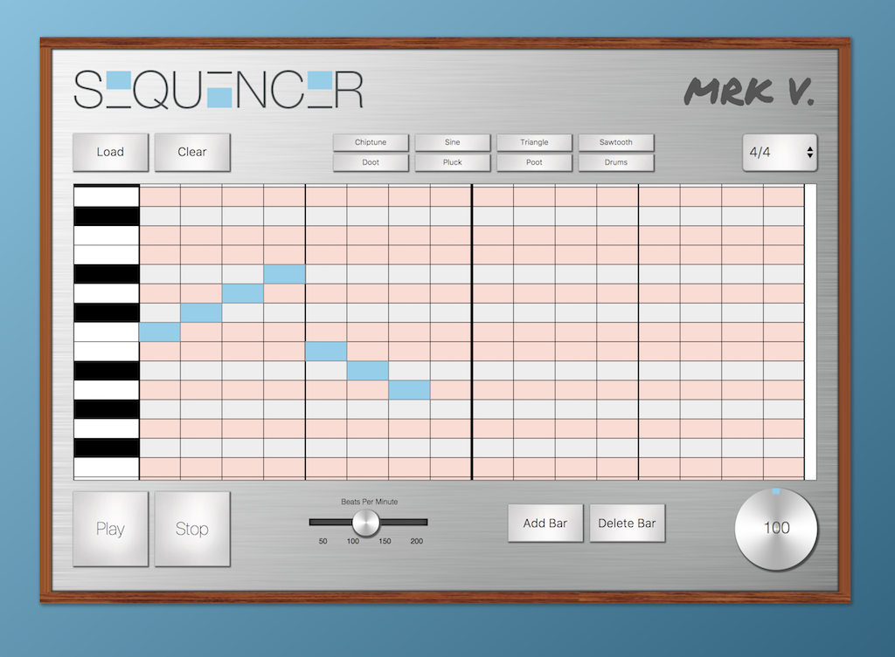

# Sequencer
### A Music Sequencer (JavaScript Group Project _12.21.2017_)
##### By Michael Arrington, Kimberly Bordon, Valia Dempsey, and Rane Fields

### Description
_A music sequencer application made using Angular framework, Konva.js and Tone.js._



### Specs
| Behavior | Input Example | Output Example |
|-|-|-|
| User can press one of the grid cells to put a note in sequence.| User clicks one of the cells. | App puts the note in sequence. |
| User can press play to start the sequence. | User clicks play button. | App plays sequence in a loop. |
| User can press pause to stop a sequence in play, and keep its current position. | User clicks pause button. | App pauses sequence.|
| User can press stop to cease a playing sequence. | User clicks stop button. | App stops playing entirely. |
| User can change instrument of sequencer. | User clicks one of the available instrument setting buttons. | App switches to that instrument. |
| User can adjust tempo of sequence. | User moves BPM slider up or down. | App increases or decreases rate of playing. |
| User can adjust volume of sequence. | User moves volume dial clockwise or counter-clockwise. | App increase or decreases volume of playing. |
| User can clear sequence grid of laid down notes. | User clicks Clear button. | App clears note grid. |

### Wishlist
| Behavior | Input | Output |
|-|-|-|
| User can change time signatures of sequence. | User selects time from drop down menu. | App changes grid to reflect time change. |
| User can add or delete more bars to sequence grid. | User clicks Add Bar or Delete Bar. | App increases or decreases note grid by one column to the right. |
| User can save song to a database. | User clicks Save button. | App saves song to database. |
| User can load song from database. | User clicks Load, which will display a selection of songs available the User can then click. | App loads sequence onto grid. |


### Setup/Install

* Make sure you have [Node](https://nodejs.org/en/download/) and the npm (Node package manager, which should come automatically) installed.
* Go to [this repository page](https://github.com/ranefields/sequencer), and clone the project.
* Navigate to top level folder of the cloned repository in terminal or powershell, and enter the following commands:
```
$ npm install
```

#### Running/Production
* To build project, enter the following:
```
$ ng serve
```
* Open browser and enter the url into address bar: _localhost:4200/sequencer_

### Known Bugs
* Some features are not yet available.


### Technology Used
* Node
* Angular
* Angular CLI
* Sass
* Konva.js
* Tone.js
* ... and many more packages. In top level of project folder, open `package.json` in Atom (or your preferred text editor) and look for `"devDependencies"` and `"dependencies"` respectively to see the entire list.

### Contact details
_Email [kbordon@gmail.com](mailto:kbordon@gmail.com), [rane.fields@gmail.com](mailto:rane.fields@gmail.com) or [michaelarringtoniphone@gmail.com](mailto:michaelarringtoniphone@gmail.com) for comments, questions, or concerns._

### License
*This software is licensed under the MIT license.*

Copyright © 2017 **Michael Arrington, Kimberly Bordon, Valia Dempsey & Rane Fields**
